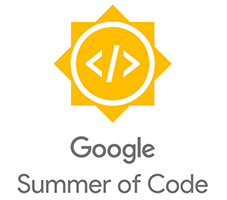
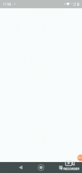
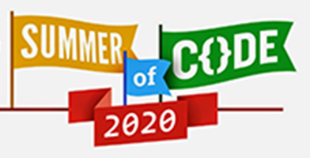

  

# Arduino Controller for Liquid Galaxy

    

### __Welcome, know a little more about the project__

This project was developed to act as a remote controller for Liquid Galaxy. With this controller the user will be able to interact with Liquid Galaxy in a more dynamic way, using a remote control that can be connected to Liquid Galaxy using a USB cable or just connecting to the same internet network via WiFi.
This project has two different controllers, the first, and more complete, has:
* Joystick for navigation;
* Ultrasonic sensor for zoom change;
* Matrix keyboard for direct navigation to predefined places;
* Buttons with special interaction functions;
* Voice recognition module

The other control is based on a controller glove, this glove has an accelerometer sensor that reads the user's hand movements and converts them into navigation movements on the Liquid Galaxy, this device also has connection characteristics similar to the first control presented and also has some interaction and navigation buttons.

 ### __Android app__
 This project also has an Android application that should be used to personalize navigation with the developed controllers. This application has a friendly and intuitive interface, with simple commands and connections for sending data to the controllers. Using this application the user will be able to:
* Change the default navigation list of controls;
* Create personalized navigation lists with your favorite places;
* Change the tour time during the tour;
* Start the connection to the WiFi network between the controls and the Liquid Galaxy and update the network data, if necessary;
* Learn a little more about GSoC, the Liquid Galaxy community and the whole project and its collaborators on the information page.

 ## __Google Summer Of Code 2020__
 This project was developed within the Google Summer of Code 2020 program. In direct collaboration with the [Liquid Galaxy project](https://www.liquidgalaxy.eu/)
 
  
 
 ### Main technologies and languages used
 
* ESP32 microntroller
* Various sensors
* C ++
* Darth
* Python
## How to install Liquid Galaxy on Virtual Machines?
You can follow the steps for installing Liquid Galaxy on virtual machines using the [manual](https://docs.google.com/document/d/1J30SqLWFFYnRM_TwNvgo-R86i58P2PMzVuVTDSnMQcc/edit?usp=sharing) or following the [video](https://www.youtube.com/watch?v=8R__KnPPErQ&t=23s) with instructions

## How to install and use?
To reproduce this project you will need a little knowledge of basic electronics and a list of specific components for assembling the controllers.
You can find a reference list by clicking [here.](https://docs.google.com/spreadsheets/d/1dB7ytINp_5vQwNA6uyauQipsMxrJ-Wr6oeAZAQ9JamU/edit?usp=sharing)

It will also be necessary to run a python script on the main machine, the steps to clone this repository on your Liquid Galaxy master machine are available in the [use and installation manual](https://docs.google.com/document/d/1tBn0hPdX7SJ-kYaByKNV1_GQNJUsSkxQtLVOuMz2EcE/edit?usp=sharing)

## Complete documentation
You can find the complete documentation for this project by clicking [here.](https://docs.google.com/document/d/1tBn0hPdX7SJ-kYaByKNV1_GQNJUsSkxQtLVOuMz2EcE/edit?usp=sharing)

## License
This software is under the [MIT](https://choosealicense.com/licenses/mit/)

Copyright 2020 [Otávio Jeus França Oliveira](https://www.linkedin.com/in/otaviojfoliveira/)
